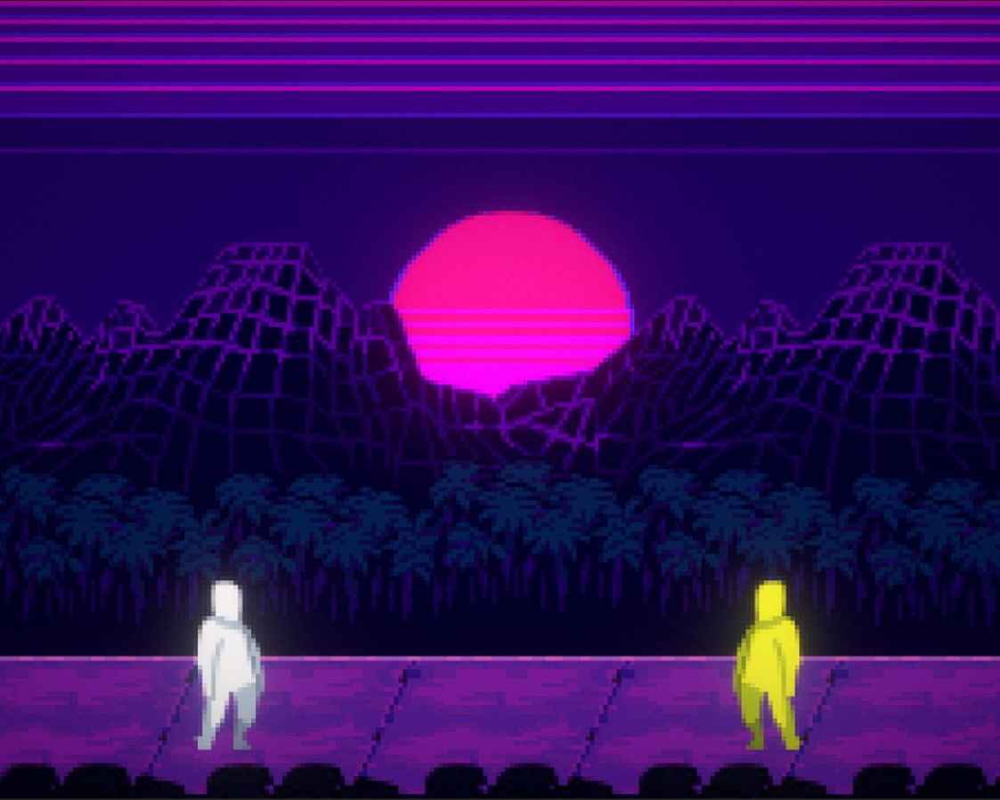

# Street Samurai

**Street Samurai** is an action-packed cyberpunk game where players take on the role of a skilled samurai navigating a futuristic dystopia. The game features high-octane combat, stealth mechanics, and a rich, neon-soaked atmosphere.


## Features
- **Dynamic Combat**: Fast-paced swordplay with combo mechanics and enemy AI.
- **Cyberpunk World**: Explore a gritty cityscape filled with neon lights and danger.
- **Character Customization**: Equip cybernetic upgrades and enhance your skills.
- **Stealth and Action**: Approach missions with precision or brute force.

## Installation
1. **Clone the Repository**:
   ```bash
   git clone https://github.com/yatesudev/street-samurai.git
   ```
2. Open in Unity: Use Unity (specific version recommended) to open the project.
3. Play: Test and play the game in the Unity editor or build it for your platform.
